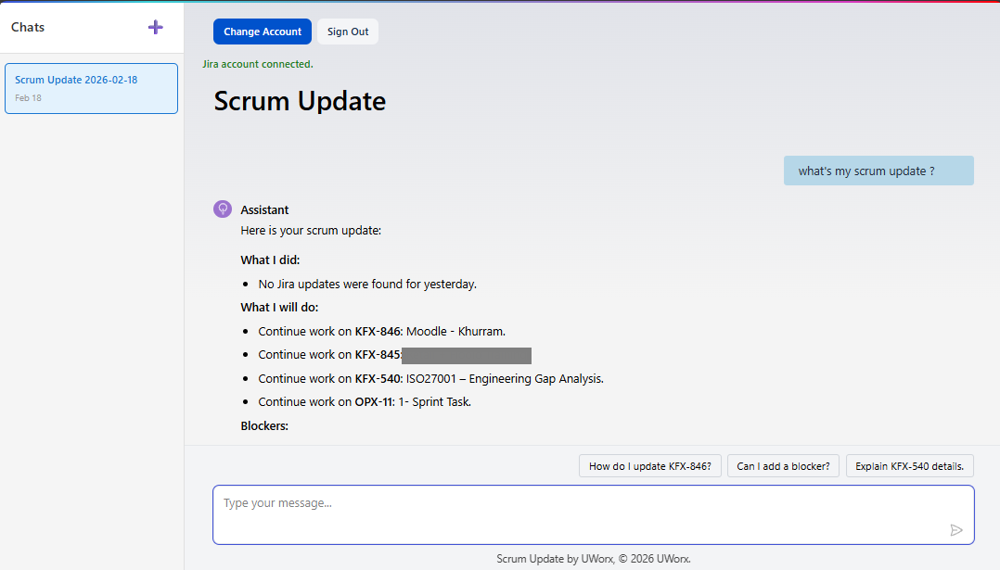

Reimagining Enterprise / Business / Personal / Utility apps as conversationional UI with AI, System + Human coworking on Shared World Model
- Chat session (ChatGPT/Claude like) acting as Blackboard / Shared World Model


## Blog posts

- Blackboard Architecture: A Classic AI Model for Collaborative Problem Solving
	- https://khurram-uworx.github.io/2026/02/15/Blackboard.html
- From Theory to Practice: Implementing Blackboard Architecture in Modern Blazor Apps
	- https://khurram-uworx.github.io/2026/02/17/Blackboard-2.html
- ScrumUpdate Deep Dive
	- https://khurram-uworx.github.io/2026/02/18/Blackboard-3.html

# ScrumUpdate

Blazor chat app for generating day-wise scrum updates as PoC of Blackboard Architecture / Shared World Model



Current setup:
- .NET 10 Blazor Interactive Server
- EF Core InMemory database (dev only)
- `DummyChatClient` in Development
- Gemini (`Google.GenAI` via `IChatClient`) when configured
- Claude (`Anthropic` via `IChatClient`) when configured
- OpenAI (`OpenAI` via `IChatClient`) when configured

## Behavior

- Chat session is created only when a scrum update is generated.
- Generated scrum update is reflected in two places:
  - Chat message history (all generated versions are preserved)
  - Rich session data (`DayWiseScrumUpdate`) where only the latest generated version is kept
- Sessions are unique by scrum date (`UserId + ScrumDate`).

## Data Model

- `ChatSession`
  - `ScrumDate`
  - `Messages`
  - `DayWiseScrumUpdate` (1:1)
- `DayWiseScrumUpdate`
  - `GeneratedTime`
  - `WhatIDidYesterday`
  - `WhatIPlanToDoToday`
  - `Blocker`

## Run

```powershell
dotnet run --project src/ScrumUpdate.Web
```

## Jira OAuth Integration

The app supports Atlassian OAuth 2.0 (3LO) and fetching Jira information.

Set credentials (recommended via user-secrets):

```powershell
dotnet user-secrets --project src/ScrumUpdate.Web set "AtlassianOAuth:ClientId" "<your-client-id>"
dotnet user-secrets --project src/ScrumUpdate.Web set "AtlassianOAuth:ClientSecret" "<your-client-secret>"
```

Atlassian app setup:
- Callback URL must include `https://localhost:<port>/auth/atlassian/callback`
- Required scopes:
  - `read:jira-work`
  - `read:jira-user`
  - `offline_access`

Implemented routes:
- `GET /auth/atlassian/login?returnUrl=/`
- `GET /auth/atlassian/callback`
- `GET /auth/atlassian/status`
- `GET /auth/atlassian/disconnect`

## Gemini Setup

Set API key (recommended via user-secrets):

```powershell
dotnet user-secrets --project src/ScrumUpdate.Web set "Gemini:ApiKey" "<your-google-api-key>"
```

Optional model override:

```powershell
dotnet user-secrets --project src/ScrumUpdate.Web set "Gemini:Model" "gemini-2.5-flash"
```

## Claude Setup

Set API key (recommended via user-secrets):

```powershell
dotnet user-secrets --project src/ScrumUpdate.Web set "Claude:ApiKey" "<your-anthropic-api-key>"
```

Optional model override:

```powershell
dotnet user-secrets --project src/ScrumUpdate.Web set "Claude:Model" "claude-haiku-4-5"
```

## OpenAI Setup

Set API key (recommended via user-secrets):

```powershell
dotnet user-secrets --project src/ScrumUpdate.Web set "OpenAI:ApiKey" "<your-openai-api-key>"
```

Optional model override:

```powershell
dotnet user-secrets --project src/ScrumUpdate.Web set "OpenAI:Model" "gpt-4.1-mini"
```

## Test

```powershell
dotnet test src/ScrumUpdate.Tests/ScrumUpdate.Tests.csproj
```
